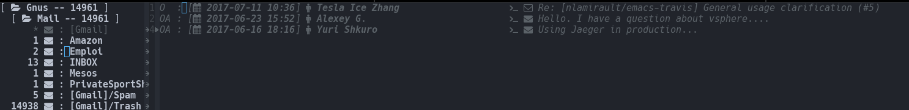

# all-the-icons-gnus

[![License GPL 2][badge-license]][LICENSE]

Master :
* 
* 

Develop:
* 
* 

``all-the-icons-gnus`` add some icons from [all-the-icons.el][] for Gnus buffers.

## Installation

The recommended way to install ``all-the-icons-gnus`` is via [MELPA][]:

    M-x package-install all-the-icons-gnus

or [Cask][]:

    (depends-on "all-the-icons-gnus")

## Usage

    (require 'all-the-icons-gnus)
    (all-the-icons-gnus-setup)

## Development

### Cask

``all-the-icons-gnus`` use [Cask][] for dependencies management. Install it and
retrieve dependencies :

    $ curl -fsSkL https://raw.github.com/cask/cask/master/go | python
    $ export PATH="$HOME/.cask/bin:$PATH"
    $ cask

### Testing

*TODO*

## Support / Contribute

See [here](CONTRIBUTING.md)

## Changelog

A changelog is available [here](ChangeLog.md).

## License

See [LICENSE](LICENSE).

## Contact

Nicolas Lamirault <nicolas.lamirault@gmail.com>

[all-the-icons-gnus]: https://github.com/nlamirault/all-the-icons-gnus
[all-the-icons.el]: https://github.com/domtronn/all-the-icons.el

[badge-license]: https://img.shields.io/badge/license-GPL_2-green.svg?style=flat
[LICENSE]: https://github.com/nlamirault/all-the-icons-gnus/blob/master/LICENSE

[GNU Emacs]: https://www.gnu.org/software/emacs/
[MELPA]: https://melpa.org/
[Cask]: http://cask.github.io/
[Issue tracker]: https://github.com/nlamirault/all-the-icons-gnus/issues

[overseer]: https://github.com/tonini/overseer.el
