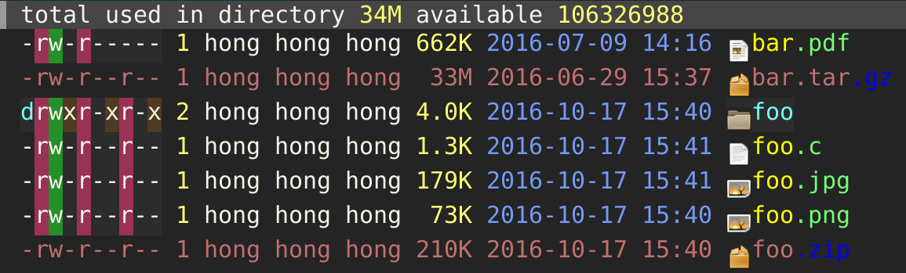

# dired-icon-mode

This package provides a minor mode `dired-icon-mode` to display an icon for each file type in dired
buffers. Currently systems which run GTK 3, such as GNU/Linux, GNU/kFreeBSD and FreeBSD, are fully
supported (pre-requisition:
[PyGObject for Python 3](https://wiki.gnome.org/action/show/Projects/PyGObject) and
optionally [the file command](http://darwinsys.com/file/)). On other systems, currently only
directory icons are displayed.

## Screenshot

## Installation

### MELPA

dired-icon can be installed from the [MELPA][] repository. Follow
the [instructions](http://melpa.org/#/getting-started) to set up MELPA and then run `package-install
RET dired-icon RET` to install.

### el-get

dired-icon can be installed via [el-get][]. Follow
the [instructions](https://github.com/dimitri/el-get#installation) to set up el-get and then run
`el-get-install RET dired-icon RET` to install.

### Manual

Download this package and add the following to your `~/.emacs` or `~/.emacs.d/init.el`:

    (add-to-list 'load-path "~/path/to/dired-icon")
    (load "dired-icon.el")

## Configuration

To display the icons in a dired buffer, simply call M-x `dired-icon-mode` inside a dired buffer. To
always display the file icons in dired buffers, add the following to your `~/.emacs` or
`~/.emacs.d/init.el`:

    (add-hook 'dired-mode-hook 'dired-icon-mode)

[el-get]: http://tapoueh.org/emacs/el-get.html
[MELPA]: http://melpa.org/#/dired-icon
