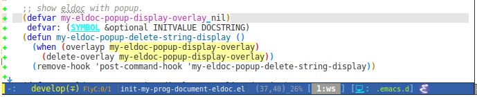

# eldoc-overlay

display eldoc doc with contextual documentation overlay for easy to look.

This source code mainly is
from [justbur](https://emacs.stackexchange.com/users/14114/justbur)
answered
[question](https://emacs.stackexchange.com/questions/29256/display-eldoc-help-info-behind-point) .

# Screenshots

