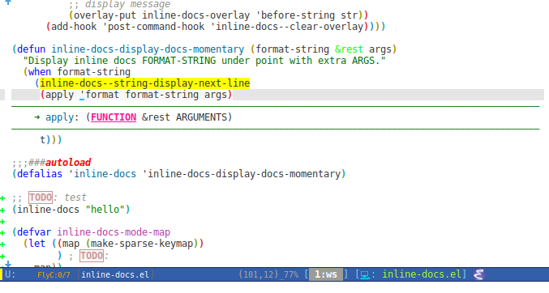

# inline-docs.el

This is a library for showing inline contextual docs above or below.

This source code mainly is
from [justbur](https://emacs.stackexchange.com/users/14114/justbur)
answered
[question](https://emacs.stackexchange.com/questions/29256/display-eldoc-help-info-behind-point) .

# Support

On theory, this mode should support all Emacs available platforms.

Tested supported:

- Emacs 24.3 or upper
- Emacs TTY mode

# Screenshots



# Usage

You can use this library function `inline-docs` in packages like [eldoc-overlay-mode](https://github.com/stardiviner/eldoc-overlay-mode).

```eldoc
(setq eldoc-message-function #'inline-docs)
```

```elisp
(inline-docs "FORMATED-STRING")
(inline-docs "STRING")
```

# related modes

- [eldoc-overlay-mode](https://github.com/stardiviner/eldoc-overlay-mode)
