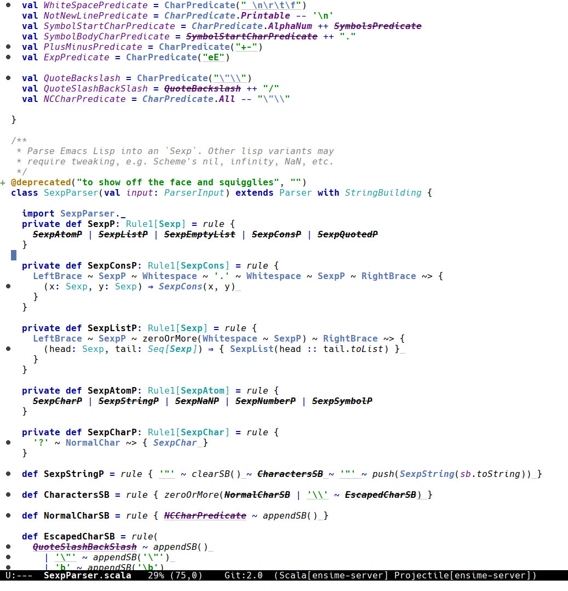

intellij-theme [](http://melpa.milkbox.net/#/intellij-theme)
===================

Emacs theme inspired by IntelliJ's default theme.

Distributed on [MELPA](https://melpa.org/), installation is recommended via [use-package](https://github.com/jwiegley/use-package):

```elisp
(use-package intellij-theme :ensure t)

;; it will not affect your main font, set independently e.g.
(add-to-list 'default-frame-alist '(font . "Hack-14"))
```


