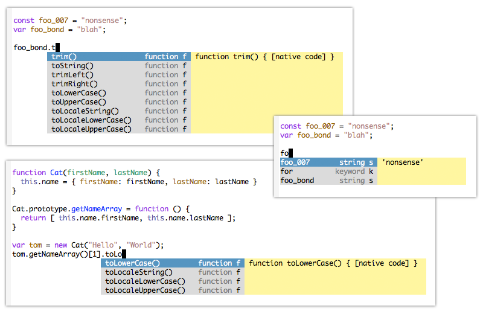
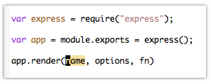
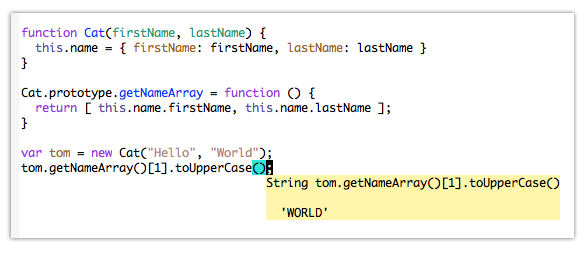

node-ac
=============

A [Node.js](http://nodejs.org/) auto-completion package for Emacs.

The package includes:

* Auto-completion by sending the simplified scripts in the current buffer to
  Node.js for evaluation.
  
* Getting documentation and expression evaluation from Node.js

* Jumping to definition point of variables and functions (currently only the
  ones in the current buffer).

Screenshots
-------------

Everybody likes screenshots:

Auto-complete:

Yasnippet integration:

Evaluation:

Installation
-------------

### Dependencies

First, you need a working version of [Node.js](http://nodejs.org/) with
correctly-set path. Typing `node --version` in the terminal under any directory
should show something like `v0.10.0`.

This package depends on the following widely used Emacs libraries:

* [js2-mode](http://code.google.com/p/js2-mode/). This package uses the
  js2-compiled syntax tree for various functionalities. I personally use the
  mooz improved version: <https://github.com/mooz/js2-mode>.

* [Auto Complete Mode](http://cx4a.org/software/auto-complete/). A github
  mirror: <https://github.com/auto-complete/auto-complete>

* [Yasnippet](https://github.com/capitaomorte/yasnippet). Yasnippet is used when
  an auto-complete entry of a function is selected (as shown in the
  screenshots).

### Installation and Configuration

    $ git clone git://github.com/MaokaiLin/node-ac.git
	
Then move the package into your site-lisp directory (typically a sub-directory
under ~/.emacs.d/).

In your .emacs file add:

    (add-to-list 'load-path "~/.emacs.d/path/to/node-ac")
	(require 'node-ac-mode)

It assumes your third party node modules are installed under
/usr/local/lib/node_modules, if not, add:

    (setq node-ac-node-modules-path "/path/to/your/modules")

Add key bindings if you like:

    (add-hook 'js2-mode-hook
	          (lambda ()
			    (local-set-key (kbd "C-.") 'node-ac-auto-complete)
			  	(local-set-key (kbd "C-c C-d") 'node-ac-show-document)
			  	(local-set-key (kbd "C-c C-j") 'node-ac-jump-to-definition)))

Version
-------------

The package is written and tested under Emcas 24. The mooz version of js2-mode
requires Emacs 24 as well.

