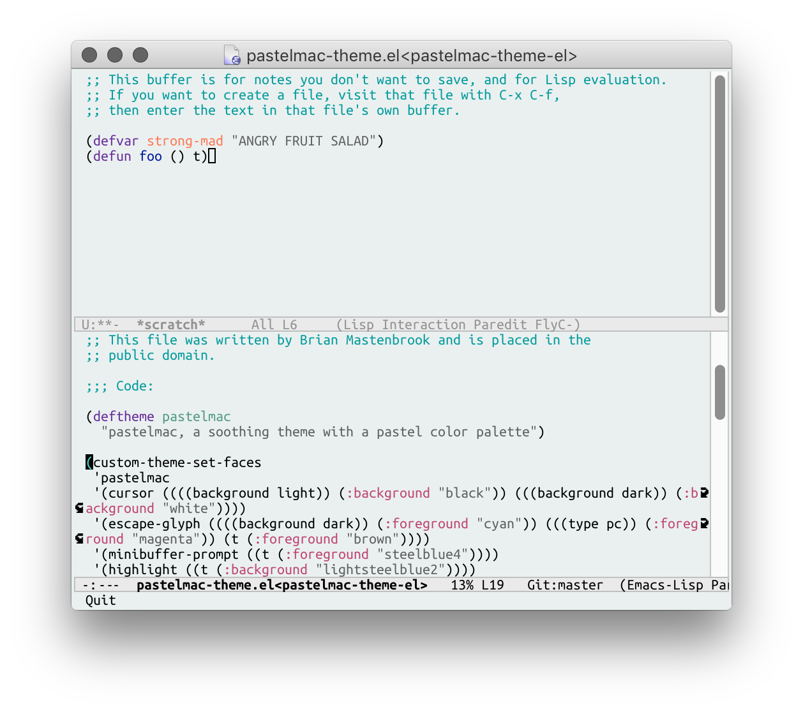

# pastelmac, a theme for Emacs 24

pastelmac is a soothing theme with a pastel color palette for Emacs 24. It is a minimalist theme, meaning that it styles the default font-lock, mode-line, and a few other faces, but leaves the rest alone. Generally speaking, default Emacs colors look pretty good with this theme as it is.

pastelmac is probably most famous for being featured in the screenshot on the [SLIME home page](https://common-lisp.net/project/slime/), which I took over a decade ago and still lives on today.

## Screenshot

