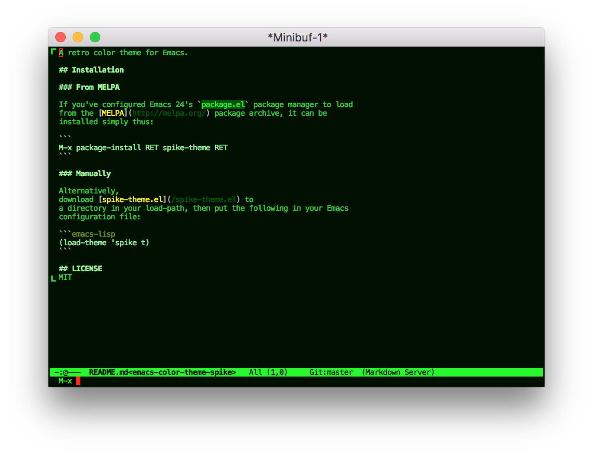

# spike-theme

[](https://melpa.org/#/spike-theme)

A light color theme with muted, autumnal colors.

## Screenshot



## Installation

### From MELPA

If you've configured Emacs 24's `package.el` package manager to load
from the [MELPA](http://melpa.org/) package archive, it can be
installed simply thus:

```
M-x package-install RET spike-theme RET
```

### Manually

Alternatively,
download [spike-theme.el](/spike-theme.el) to
a directory in your load-path, then put the following in your Emacs
configuration file:

```emacs-lisp
(load-theme 'spike t)
```

## LICENSE
MIT
