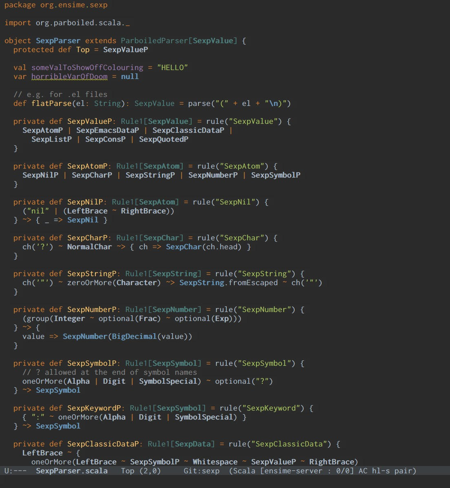

darcula-theme-emacs [](http://melpa.milkbox.net/#/darcula-theme)
===================

Emacs theme inspired by IntelliJ's Darcula.

Distributed on [MELPA](https://melpa.org/), installation is recommended via [use-package](https://github.com/jwiegley/use-package):

```elisp
(use-package darcula-theme
  :ensure t
  :config
  ;; your preferred main font face here
  (set-frame-font "Inconsolata-14"))
```


